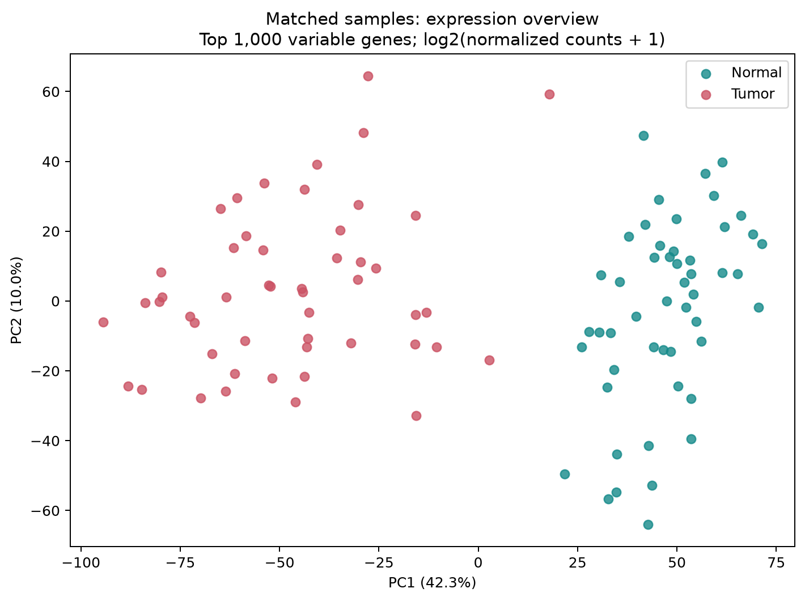

# Lung adenocarcinoma expression and survival study

Completed October 5, 2026. Prepared for Hamza Ahmed with AI assistance.

**Start with the [research summary](Research_Summary.md).** Download [Research_Report.html](Research_Report.html) and open it in your browser for the full standalone report. See the [methods](docs/analysis_plan_v2.md), [sources](docs/sources.md), and [learning guide](docs/learning_guide.md).

## Findings

- 50 matched TCGA tumor/non-tumor pairs; 19,026 genes passed the expression filter.
- 13,821 genes passed FDR <0.05 and convergence checks; 4,528 also had |log2FC| >=1.
- All 10 expression-selected genes showed the same direction in GSE31210 and passed exploratory external expression FDR <0.05.
- Survival models included 465 TCGA patients (169 deaths) and 204 GEO patients (30 deaths).
- No candidate passed corrected survival significance in either cohort. This project does not establish prognostic biomarkers.

## Files

| Folder/file | Contents |
|---|---|
| Research_Report.html | Full standalone report, eight figures, interpretation, limitations and sources |
| Research_Summary.md | Brief findings and artifact map |
| docs/learning_guide.md | Plain-language explanation and interview practice |
| docs/analysis_plan_v2.md | Frozen methods and candidate-selection rule |
| docs/decision_log.md | Changes, diagnostics and sensitivity-analysis rationale |
| docs/sources.md | Data and method sources |
| metadata/ | GDC snapshots, file identities, audit, manifest and checksums |
| results/ | Complete gene results, paired count matrix, clinical eligibility, diagnostics, pathways and candidate comparisons |
| results/figures/ | PNG and editable-vector SVG figures |
| scripts/ | Download, analysis, validation and report-generation code |
| requirements-lock.txt | Exact Python package versions used |
| reproduce.ps1 | Windows reproduction entry point with a user-supplied Python 3.12 executable |

## Reproduce

Use Python 3.12. The entry-point script creates an isolated environment in the project, installs the locked dependencies, downloads approximately 2.4 GB of public inputs, verifies checksums, and runs all stages. Allow additional space for caches and results; the observed analysis used several GB of RAM. A computer with at least 16 GB RAM is advisable for this implementation. Runtime depends on the computer and network.

Run reproduce.ps1 with its -PythonExe argument pointing to your Python 3.12 executable.

The delivered metadata are frozen. Do not refresh them casually when reproducing this report. New GDC snapshots require a new cohort audit and report version. Downloaded reference content is checked against the delivered hashes and stops if the upstream source changed. Binary caches are local performance aids and are not included in the package.

The original completed execution used the adjacent work/tcga-luad directory for large inputs. The reproduction script sets TCGA_WORKDIR to this project's data directory so the extracted package is portable. Existing output files will be regenerated during reproduction; use a copy of the package to preserve the original report.

This is an observational research portfolio analysis, not a clinical test. The report includes failed-fit flags and negative survival results. No university submission or wet-lab work is implied.
